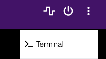

# Homebridge-Hisense-TV

[](https://github.com/MrAsterisco/homebridge-hisense-tv/actions/workflows/build.yml)

This is a plugin for Homebridge that allows you to control your RemoteNow-enabled Hisense TVs, using a custom version of the [hisensetv](https://github.com/MrAsterisco/hisensetv) tool. With this plugin, you can:

- See the status of the TV (on/off, current input).
- Turn on and off.
- List inputs (using the display name set on the TV) and switch between them.
- List apps and launch them.
- Control the TV volume.
- Remote control using the native iOS remote.

## Requirements

- NodeJS 18 or later.
- Homebridge 1.6.0 or later.
- A Hisense TV that supports the RemoteNow app ([App Store](https://apps.apple.com/us/app/remotenow/id1301866548) or [Play Store](https://play.google.com/store/apps/details?id=com.universal.remote.ms&hl=en&gl=US)).
  - WakeOnLan (WOL) must be enabled on the TV to turn it on with this plugin.
  - The TV must be configured with a static IP Address or a static DHCP reservation
- *Starting with version 2.0.0, macOS is also supported as host*.

## Compatibility
If you have any issues please check the [Known Issues](#Known-Issues) section first, if your issue is not listed there, please open an issue on GitHub.

### TVs
In theory, any RemoteNOW enabled TV should work with this plugin. However, some TVs have different behaviors, different SSL configurations and may not work completely or may require additional steps.

> Starting with VIDAA U6 (2022) and continuing with VIDAA U7 (2023), native AirPlay and HomeKit support is built-in. For these TVs, this plugin is not required.

#### Known Incompatibilities

Some TV models have been reported as incompatible or are known to cause problems.

- HU50A6800FUW (50" H8G 2020) - See [this issue](https://github.com/MrAsterisco/homebridge-hisense-tv/issues/37).

# Installation

Search for the plugin in Homebridge:

```
homebridge-hisense-tv-remotenow
```
You also need some additional dependencies, if you haven't installed them already. Follow the instructions below for your operating system and then proceed to "Setting up the TV".

## Setting up the TV

First, identify the mac address of your network interface (on the machine where you are running homebridge). 
On Linux, you can use the `ifconfig` command, while on Windows, you can use `ipconfig`. 
Often you can also find this information in the network settings of your operating system.

The mac address is needed in the next step and in the config.json file.

### Continue the Setup
For this plugin to work correctly, you need to configure your TV to use a static DHCP (or configure a static reservation on your router). 

To connect to your TV, you need to pair the machine where you're running Homebridge with your TV. This is done in the command line, by manually running the bundled `hisense-tv-authorize` command. To do this, open the homebridge UI and go to Terminal.


    
Then **turn your TV on** and run one of the following commands, replacing `<TV_IP_ADDRESS>` with the IP address of your TV and `<HOMEBRIDGE_MAC_ADDRESS>` with the mac address of the network interface you found out previously.
If this one fails, try the other commands.

SSLMode: default (most common)
```bash
hisense-tv-authorize --hostname <TV_IP_ADDRESS> --mac <HOMEBRIDGE_MAC_ADDRESS>
```

SSLMode: disabled (no SSL)
```bash
hisense-tv-authorize --hostname <TV_IP_ADDRESS> --mac <HOMEBRIDGE_MAC_ADDRESS> --no-ssl
```

SSLMode: custom (use cert and key below)
Replace `<CERTFILE>` and `<KEYFILE>` with the path to the certificate and key files you want to use.
```bash
hisense-tv-authorize --hostname <TV_IP_ADDRESS> --mac <HOMEBRIDGE_MAC_ADDRESS> --certfile <CERTFILE> --keyfile <KEYFILE>
```

Your TV, if compatible, will display a PIN code: insert it in the command line and confirm. Your device is now paired with your TV and they can communicate when the TV is on. Repeat this step for all the TVs you want to use via HomeKit.

*If the command times-out after a while, make sure your TV is connected to the network and turned on. You can try to `telnet <TV_IP_ADDRESS> 36669` to make sure your Homebridge instance can reach your TV. If telnet works but this command doesn't, try to run the plugin without this step, it could mean your TV and your machine are already paired.*

## Configure the plugin

You can use the Homebridge UI to make changes to the plugin configuration. You must set the "Homebridge MAC Address" to the mac address you found out previously and then configure your TVs (include the { } if configuring on Windows). Then, just add all the TVs you have authorized earlier:

- as ID, you can input your TV's S/N or your own identifier, as long as it's unique in your Home. You can also leave the default value, if you have just one TV. Whatever you input, will be displayed as the accessory "Serial Number" in Home.
- as name, input the display name that the Home app will suggest when adding this TV to your Home.
- as IP address, input the IP that you have assigned to your TV.
- as MAC Address, input the MAC Address of your TV (if your TV is connected both via WiFi and Ethernet, make sure to configure the interface that your TV is using). 
- as SSLMode, input the SSL mode that your TV requires that you previously found out during activation.

Repeat the configuration for each TV you want to use, then restart Homebridge.

### SSL mode

Since version 1.1.0, this plugin also supports connecting to Hisense TVs that require different SSL modes than the default one. For example, some models have an unrecognized certificate and some other models need a specific encryption to be used.

To change how the plugin connects to your TV, use the `sslmode` config key. See below in the config example for more info.

*If your TV needs a specific encryption key and certificate, you can find the most common ones [here](https://github.com/MrAsterisco/hisensetv/tree/master/cert). Choose the appropriate one and download it onto the machine that executes Homebridge.*

*When providing the certificate and its key, you'll need to store them outside of the plugin folder (i.e. outside of the `node_modules` directory). If you store them in the directory, they will be deleted when a new version of the plugin is installed. It is not important where you store them, as long as they are readable by the `homebridge` user.*
On Linux, you can store them in `/etc/ssl/certs` and then provide the absolute path to the plugin.

### Config example

```json
{
  "platform": "HiSenseTV",
  "macaddress": "Your Homebridge MAC Address",
  "devices": [
    {
      "id": "A unique identifier (such as your TV S/N)",
      "name": "A name to display in the Home app",
      "showApps": false,
      "apps": [],
      "tvType": "default",
      "pollingInterval": 3,
      "wolInterval": 400,
      "wolRetries": 3,
      "ipaddress": "Your TV IP address",
      "macaddress": "Your TV MAC Address",
      "sslmode": "default (most common)|disabled (no SSL)|custom (use cert and key below)",
      "sslcertificate": "/absolute/path/to/the/ssl/certificate.cer",
      "sslprivatekey": "/absolute/path/to/the/ssl/privateKey.pkcs8"
    }
  ]
}
```

### Adding Apps as Input Sources
In the config, **showApps** can be set to `true` to enable showing Apps as Input Sources.
If you want all installed apps to be shown, you can leave the **apps** array empty. If you want to show only specific apps, you can list them in the **apps** array. The app names must match the names on the TV exactly.

```json
{
  ...
  "devices": [
    {
      ...
      "showApps": true,
      "apps": ["Netflix", "YouTube"],
      ...
    }
  ]
}
```

### Always On TVs (TVs that aren't fully turning off)
Some TVs may be shown as "On" even when you turn them off. If you have a TV that is always on, you can change the `tvType`.

**tvType** may be changed to either:

- fakeSleep
- pictureSettings

This can be different for each TV, because the behavior is not consistent across all models. 
To find out which one works for you, you can try running the `hisense-tv-always-on-test` command. (From the Homebridge Terminal)
The script will guide you through the process of finding the correct `tvType` for your TV.
If you find any issues with the script, please open an issue on GitHub, as I couldn't test that script with my TV.

If the script suggest "Fake Sleep" you just have to change the `tvType` in the config file to `fakeSleep`:
Otherwise if its suggesting something with "Picture Settings" you have some more steps to do:

#### Picture Settings
Picture Settings are literally the settings of the TV. Some always on TVs change specific settings when they are turned off.
In the config you can set the `menuId` and `menuFlag` to the values that are changed when the TV is turned off, this plugin will then also consider the TV as off.
For Example [this](https://github.com/MrAsterisco/homebridge-hisense-tv/issues/18#issuecomment-1247593321) User reported "HDMI Dynamic Range" (menu_id=23) gets set to **1** when the TV is turned off.
Which would mean the config needs to look like this:

```json
{
  ...
  "devices": [
    {
      ...
      "tvType": "pictureSettings",
      "menuId": 23,
      "menuFlag": 1,
      ...
    }
  ]
}
```


## Add the TV to Home

Once Homebridge is ready, look for a log line in the Homebridge log that looks like this one:

```
Please add [HiSense <SOME NUMBERS>] manually in Home app. Setup Code: XXX-XX-XXX.
```

Take a note of the Setup Code and open your Home app on your iPhone, iPad or Mac.

**Make sure you are connected to the same network as Homebridge and that your TV is turned on, then follow these steps:**

- Tap the "+" button in the Home app and choose "Add Accessory".
- Tap "I Don't Have a Code or Cannot Scan".
- Your device should automatically detect the TV and show it. If it doesn't, make sure your network is up. You can also try and go ahead anyway by tapping "My Accessory Isn't Shown Here".
- Input the "Setup Code" you found in the Homebridge logs.

**Done**! As always, you can repeat the steps above if you have multiple TVs to add. Please note that each TV will have a different Setup Code logged in Homebridge.

## Issues
This plugin has been developed and tested running Homebridge on Ubuntu Linux 20.04 and macOS Monterey with a Hisense 50AE7010F. If your configuration differs, the steps below may not be a 100% accurate: even if the general idea is the same *(pair the TV, add it to Home, use it)*, your mileage may vary.

**If you find anything that is not correct, please open an issue (or even better: a PR changing this file) explaining what you're doing differently to make this plugin work with different TV models and/or on different operating systems.**

### Known Issues
- The input list might not be fetched correctly if the TV is turned off while adding the accessory or after restarting Homebridge. 
  - FIX: force close your Home app and open it again. (try it a few times)
- Your TV gets shown as "ON" even when it's off.
  - FIX: read Section [Always On TVs (TVs that aren't fully turning off)](#always-on-tvs-tvs-that-arent-fully-turning-off)
- Some TVs have inconsistent data regarding apps
  - Opening an app may work from homekit
  - Due to the inconsistent data, the current selected app on the tv may not be shown correctly in homekit (will be "Unknown")

# Contributions
All contributions to expand the library are welcome. Fork the repo, make the changes you want, and open a Pull Request.

If you make changes to the codebase, I am not enforcing a coding style, but I may ask you to make changes based on how the rest of the library is made.

# Credits
This plugin makes use of a modified version of the [hisensetv](https://github.com/newAM/hisensetv) Python script, originally written by [Alex](https://github.com/newAM) and distributed as open-source software [here](https://github.com/MrAsterisco/hisensetv).

The code structure and style is heavily inspired by the [homebridge-smartglass plugin](https://github.com/unknownskl/homebridge-smartglass), written by [UnknownSKL](https://github.com/unknownskl).

SSL Support has been implemented with a lot of help from [chinedu40](https://github.com/chinedu40) and [ryanshand](https://github.com/ryanshand).

# License
This plugin is distributed under the MIT license. See LICENSE for details.
