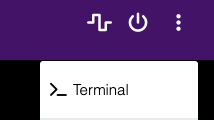

# Homebridge-Hisense-TV

[](https://github.com/MrAsterisco/homebridge-hisense-tv/actions/workflows/build.yml)

A Homebridge plugin to control RemoteNow-enabled Hisense TVs.

> **Note:** Starting with VIDAA U6 (2022) and VIDAA U7 (2023), native AirPlay and HomeKit support is built-in. For these TVs, this plugin is not required.

**Features:**
- Power on/off (requires Wake-on-LAN depending on TV model)
- View current status and input
- Switch inputs and launch apps
- Control volume and use the native iOS remote

## Step 1: Prerequisites

- **NodeJS 22+** and **Homebridge 1.8.0+**.
- **Compatible TV:** A Hisense TV that works with the [RemoteNow](https://apps.apple.com/us/app/remotenow/id1301866548) app ([Android](https://play.google.com/store/apps/details?id=com.universal.remote.ms&hl=en&gl=US)).
- **Wake-on-LAN (WoL):** Must be enabled in your TV's network settings.
- **Static IP:** Assign a static IP to your TV (either on the TV itself or via a DHCP reservation on your router).
- **Host MAC Address:** Find the MAC address of the machine running Homebridge (`ifconfig` on Linux/Mac, `ipconfig` on Windows). You will need this for pairing and configuration.
- **TV MAC Address:** Find your TV's MAC address in the TV's network settings menu. If your TV is connected via both WiFi and Ethernet, use the MAC for the interface it's actively using.

## Step 2: Install

Search for the plugin in the Homebridge UI:

```
homebridge-hisense-tv-remotenow
```

## Step 3: Pair with your TV

Homebridge needs a one-time authorization with your TV.

1. **Turn your TV on.**
2. Open the Homebridge UI and go to **Terminal**.

   

3. Run the authorize command, replacing the placeholders:

   ```bash
   hisense-tv authorize --hostname <TV_IP_ADDRESS> --mac <HOMEBRIDGE_MAC_ADDRESS>
   ```

4. A PIN code should appear on your TV — type it into the terminal and press Enter.

Repeat this for each TV you want to control.

> **Timed out?** Make sure your TV is on and reachable. You can verify connectivity with `telnet <TV_IP_ADDRESS> 36669`. If that works but the command doesn't, your TV may already be paired — try skipping to Step 4.
>
> **Still not working?** Your TV may require a different SSL mode. See [Pairing with different SSL modes](#1-pairing-with-different-ssl-modes) below.

## Step 4: Configure the Plugin

Open the plugin settings in the Homebridge UI and enter your details. Here is what a basic configuration looks like:

```json
{
  "platform": "HiSenseTV",
  "macaddress": "<YOUR_HOMEBRIDGE_MAC_ADDRESS>",
  "devices": [
    {
      "id": "Hisense-LivingRoom-01",
      "name": "Living Room TV",
      "ipaddress": "<YOUR_TV_IP_ADDRESS>",
      "macaddress": "<YOUR_TV_MAC_ADDRESS>",
      "tvType": "default",
      "sslmode": "default"
    }
  ]
}
```

| Field | Description |
|---|---|
| `id` | A unique identifier (e.g. your TV's serial number or any unique string you like). |
| `name` | Display name suggested when adding the TV to Apple Home. |
| `ipaddress` | Your TV's static IP address. |
| `macaddress` | Your TV's MAC address (use the interface — WiFi or Ethernet — that the TV is connected with). |
| `tvType` | Power detection method: `default`, `fakeSleep`, or `pictureSettings`. See [TV always shows as "ON"](#2-tv-always-shows-as-on-in-homekit). |
| `sslmode` | `default`, `disabled`, or `custom`. Must match what worked during pairing. |
| `sslcertificate` | *(only for `custom` sslmode)* Absolute path to the SSL certificate. |
| `sslprivatekey` | *(only for `custom` sslmode)* Absolute path to the SSL private key. |
| `showApps` | Set to `true` to show TV apps as input sources. |
| `apps` | List of app names to show, e.g. `["Netflix", "YouTube"]`. Leave empty `[]` to show all installed apps. Names must match exactly. |
| `pollingInterval` | *(default: 4)* Seconds between power-state polling checks (only used when `tvType` is `default`). |
| `wolInterval` | *(default: 400)* Milliseconds between WoL packets. |
| `wolRetries` | *(default: 3)* Number of WoL packets sent (to account for packet loss). |

Save your configuration and restart Homebridge.

## Step 5: Add to Apple Home

**Your TV must be turned on for this step at least once after setting up the plugin.** The plugin waits for TV data before publishing the accessory, so the setup code won't appear in the logs until the TV is reachable.

1. Check your Homebridge logs for a line like:
   ```
   Please add [HiSense 123456] manually in Home app. Setup Code: XXX-XX-XXX.
   ```
2. Open the **Home** app on your iPhone or iPad.
3. Tap **+** → **Add Accessory** → **More options...** (or "I Don't Have a Code or Cannot Scan").
4. Select your TV and enter the Setup Code from the logs.

Each TV has a different Setup Code. Repeat for each TV.

---

## Advanced Settings & Troubleshooting

### 1. Pairing with different SSL modes

Some TVs require different encryption. If Step 3 failed, try these alternatives:

**No SSL:**
```bash
hisense-tv authorize --hostname <TV_IP> --mac <MAC> --no-ssl
```

**Custom SSL** (requires downloading certificates from [here](https://github.com/MrAsterisco/hisensetv/tree/master/cert)):
```bash
hisense-tv authorize --hostname <TV_IP> --mac <MAC> --certfile <CERT_PATH> --keyfile <KEY_PATH>
```

If you use custom SSL, update `sslmode`, `sslcertificate`, and `sslprivatekey` in your plugin config.

> **Important:** Store certificate files outside of `node_modules/` — they will be deleted when the plugin updates. On Linux, `/etc/ssl/certs` is a good location.

### 2. TV always shows as "ON" in HomeKit

Some TVs don't fully turn off their network interface when sleeping. Run this in the Homebridge Terminal to find the right setting:

```bash
hisense-tv always-on-test
```

- **If it suggests Fake Sleep:** Set `"tvType": "fakeSleep"` in your config.
- **If it suggests Picture Settings:** Set `"tvType": "pictureSettings"` and add the `menuId` and `menuFlag` values the script provides.

  For example, [one user](https://github.com/MrAsterisco/homebridge-hisense-tv/issues/18#issuecomment-1247593321) found that "HDMI Dynamic Range" (`menuId: 23`) changes to `1` when the TV sleeps:
  ```json
  {
    "tvType": "pictureSettings",
    "menuId": 23,
    "menuFlag": 1
  }
  ```

### 3. Debugging

- **Enable debug logs:** Turn on Homebridge Debug Mode in the Homebridge UI settings for more detailed logs.
- **Watch MQTT traffic:** Run `hisense-tv listen-to-mqtt` in the terminal to see raw MQTT messages from the TV.
- **Send raw MQTT commands:** Run `hisense-tv send-mqtt-command` for manual testing.

## Known Issues

- **Default input names after pairing** (e.g. "Input Source" instead of "HDMI 1"): This is an Apple HomeKit bug. During pairing, tap "X" → "Setup Later". After pairing: Restart Homebridge, and the correct names will load.
- **Current app shows as "Unknown":** Some TVs report inconsistent app data — this is a TV firmware limitation.

### Known Incompatibilities

Some TV models have been reported as incompatible:
- HU50A6800FUW (50" H8G 2020) — see [this issue](https://github.com/MrAsterisco/homebridge-hisense-tv/issues/37).

## Contributions

All contributions are welcome. Fork the repo, make your changes, and open a Pull Request.

## Credits

Originally inspired by the [hisensetv](https://github.com/newAM/hisensetv) Python script by [Alex](https://github.com/newAM). SSL support was implemented with help from [chinedu40](https://github.com/chinedu40) and [ryanshand](https://github.com/ryanshand).

## License

This plugin is distributed under the MIT license. See [LICENSE](LICENSE) for details.
